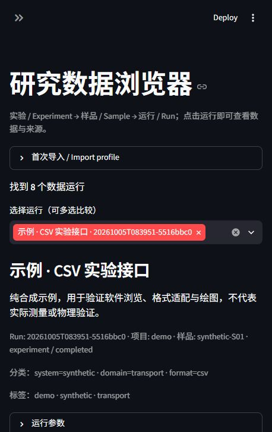

# ResearchData

直接在界面选择九种风格、字体/字号、线宽、网格和图例，并保存可复用配方。
在科学项目中运行 `research-data project init`，将数据映射与多面板绘图结构保存为
`research-data.project.json`。`research-data open --project-dir PATH` 打开对应模板。
用户和 agent 使用同一套配置，模板和输入数据分别保留源码/Git 来源。
详见 [项目模板与可视化编辑](docs/PROJECT_TEMPLATES.md)。

实验与计算共用的本地科研数据管理软件：**数据 → 描述与分类 → 生成时的源码/Git → 可复用绘图 → 图的输入与配方**。

这是**本地 Web 应用**，浏览器负责查看与绘图，数据保存在你的电脑。Windows
双击 `Start-ResearchData.cmd` 即可安装并打开；环境准备好后，CMD 一行
`research-data.cmd open` 即可打开，重复执行会复用同一数据目录的后台服务。

ResearchData 借鉴 QCoDeS 的实验/run、参数、数据集与来源记录方式，并使用 QCoDeS 官方接口读取真实数据集。它是独立实现的目录和绘图层；仪器采集仍可交给 QCoDeS，计算仍使用你已有的 Python、Julia 或其他程序。



## 功能

- 每次运行保存详细说明、project、sample、kind、tags、键值分类、参数、所属任务和父数据集。
- 总列表浏览：SQLite 索引直读的运行总表（点击行选中，最新在前），侧栏按项目/类型/状态与分类键
  facet 筛选加搜索；大目录（>300 运行）自动改用"加入对比"篮代替巨型多选框。`rust/rspeed`
  提供可选 Rust 加速扩展（maturin 构建，未构建时自动回退纯 Python），索引扫描/JSON 解码约 2 倍加速。
- 在生成前记录完整 Git commit、当时的 branch、dirty 状态、入口和命令；保存实际工作区源码快照，包括声明的未提交/未跟踪文件。界面可以直接查看和下载源码。
- 原始文件复制到托管目录并记录 SHA-256；SQLite 数据库使用一致性备份。独立 JSON manifest 和数据卡持久保存，SQLite 索引可以重建。
- 中文/全文检索、类别/标签/Git 筛选、参数范围检索。
- CSV、TSV、JSON/JSONL、HDF5、NetCDF、Parquet、QCoDeS 数据集统一适配成 xarray，保留值、坐标和已声明单位；导入 profile 可复用。
- 折线、散点、多数据比较、二维热图、复数分量、高维整数切片；9 种风格，可保存绘图 recipe，导出 HTML/PNG/SVG/PDF。
- 分析图另建 run，保存输入 run/artifact ID、文件哈希、配方、软件版本与绘图源码。
- 自动匹配的 Codex skill；agent 使用同一套 API/CLI，Julia 等程序只需将输出写入指定文件夹。

## 安装并打开

需要 Python 3.11+。Git 用于记录版本；未安装 Git 或来源不是 Git 项目时仍保存源码，Git 字段为空。

```powershell
git clone https://github.com/fangrh/research-data.git
cd research-data
python -m venv .venv
.venv/Scripts/python -m pip install -e ".[ui,formats,export]"
.venv/Scripts/python -m research_data --root demo-catalog demo --with-qcodes
.venv/Scripts/python -m research_data --root demo-catalog open
```

Windows 也可运行 `./scripts/setup.ps1 -Agent -Catalog D:/research-data-library`，然后双击 `Start-ResearchData.cmd`。默认优先使用 **http://127.0.0.1:8765/**，被占用时自动选择附近空闲端口；以启动输出的 `url` 为准。示例均为标明的合成数据。

普通包安装：`python -m pip install "research-data[ui,formats,export] @ git+https://github.com/fangrh/research-data.git"`。

`ui` 安装网页界面，`formats` 安装 Parquet/QCoDeS，`export` 安装静态图导出。PNG/SVG/PDF 还需要 Chrome/Chromium；缺少时显示具体错误，HTML 可直接使用。HTML 使用 Plotly CDN，离线查看可用 Plotly 本地 bundle。

已有 Chromium 时用 `research-data configure --browser PATH/TO/chrome.exe` 指定；也可用 `python -c "import kaleido; kaleido.get_chrome_sync()"` 安装 Kaleido 的 Chrome。配置保存在用户目录，不写入软件仓库。

### 命令发现与一键启动

安装后可用 `research-data help` 查看当前命令。`research-data help COMMAND --json`
输出由实际 argparse parser 生成的选项、必填参数、默认值和示例，适合脚本与
coding agent；`research-data guide WORKFLOW --json` 输出 `generate`、`import`、
`plot`、`browse` 或 `agent` 的工作流决策图。人类可省略 `--json` 获得可读说明。

```text
research-data.cmd open
research-data status
research-data help run --json
research-data guide generate
```

`open` 启动托管的本机服务并打开浏览器；`serve` 在前台运行并支持 Ctrl+C，
`browse` 保留为兼容别名。Windows 可直接运行 `Start-ResearchData.cmd`（首次
运行会准备环境），或在源码 checkout 中运行 `research-data.cmd open`；安装后的
console entrypoint 仍是 `research-data open`。需要桌面快捷方式时可运行
`powershell -NoProfile -ExecutionPolicy Bypass -File scripts\desktop-shortcut.ps1`。
详见 [docs/USAGE.md](docs/USAGE.md)。

## 让 agent 默认使用

```powershell
.venv/Scripts/python -m research_data install-agent --catalog D:/research-data-library
```

安装 `~/.codex/skills/research-data` 并记录当前 Python 和共享目录，附带选择正确 Python 的 launcher。新会话读取新的 skill 清单；也可以明确说“使用 research-data 生成并登记数据”。这是 agent 工作指引，自动执行取决于宿主的 skill 选择。

目录优先级：`--root` → `RESEARCH_DATA_CATALOG` → 安装时的共享目录 → `~/ResearchData`。更换 Python 环境后重新运行 `install-agent`。

## 生成数据时登记

```python
from research_data import Catalog

catalog = Catalog("D:/research-data-library")
with catalog.run(
    title="样品 S17：2 K 电流扫描", project="transport", kind="experiment",
    sample="S17", description="说明目的、仪器、处理方法和已知限制。",
    parameters={"temperature_K": 2.0, "field_T": 0},
    categories={"domain": "transport", "system": "NbSe2", "stage": "raw"},
    tags=["IV", "cooldown-03"], task_id="TASK-123",
    repo="D:/my-project", entrypoint="measure.py",
    source_paths=["measure.py", "src", "requirements.txt"],
) as run:
    # 使用已有采集/计算程序生成文件。
    run.add_artifact("results/curve.csv", description="原始 I-V；按采集顺序保存。",
                     profile={"x": "voltage", "units": {"voltage": "V", "current": "A"},
                              "descriptions": {"current": "Measured current"}})
print(run.run_id)
```

`completed` 表示执行结束。科学验证单独记录：

```python
catalog.set_validation(run.run_id, "partial", evidence=["validation-report.md"],
                       notes="已比较一个参考样品；其他温度尚未检查。")
```

`passed` 要求提供证据，软件不会判断科学结论正确与否。

## 包装 Python / Julia / 其他程序

程序将输出写入 `RESEARCH_DATA_OUTPUT`；wrapper 在执行前捕获来源，执行后登记输出和 stdout/stderr。失败会留下 failed run 并返回原退出码。

```powershell
research-data --root D:/research-data-library run --title "Synthetic Python example" --description "软件示例，非物理结果" --repo . --source examples/generate.py --entrypoint examples/generate.py --profile examples/transport-profile.json -- python examples/generate.py
research-data --root D:/research-data-library run --title "Synthetic Julia example" --repo . --source examples/generate.jl --entrypoint examples/generate.jl --profile examples/transport-profile.json -- julia examples/generate.jl
```

还有 `RESEARCH_DATA_RUN_ID`、`RESEARCH_DATA_RUN_DIR`、`RESEARCH_DATA_CATALOG`。输出目录中的文件自动登记；外部输出用 `register` 显式登记。

## 历史数据与格式映射

```powershell
research-data profile transport examples/transport-profile.json
research-data import old.csv --title "历史电流扫描" --kind experiment --project transport --sample S17 --description "原测量脚本未保存" --tag IV --category domain=transport --parameter temperature_K=2 --profile transport
```

历史文件默认来源 `unknown`，不会套用当前 Git 版本。确有依据时才显式提供 `--repo`、`--entrypoint` 和 `--source`。

批量历史导入用 Python API 的 `register_artifacts(run_id, paths, strict=False)`：一次写 manifest
和索引，失败的文件记入返回的 errors 而不中断整批；完成状态建议 `finish_run(run_id, "imported")`。

| 格式 | 首次说明的映射 |
|---|---|
| CSV / TSV / JSON / JSONL / TOML / Parquet | `x`、`rename`、`units`、`descriptions`；JSON 与 TOML 为 records（含 `records`/`data`/`rows` 键）或 column arrays |
| HDF5 | `variables` 选择路径或路径→名称映射；`coordinates` 指定变量维度；也读取 `dimensions` 属性或维度标签 |
| NetCDF | 读取文件自身变量、维度和单位 |
| QCoDeS SQLite | `qcodes_guid` 或 `qcodes_run_id`，通过官方只读接口读取 |

HDF5 profile 示例：

```json
{"variables":{"axes/T":"temperature","axes/B":"field","response/J":"current"},"coordinates":{"current":["temperature","field"]},"units":{"temperature":"K","field":"T","current":"A"}}
```

原始文件的列名/维度没有通用含义，首次映射需要检查；profile 保存这些含义，之后相同 schema 直接复用。输入文件中的代码不会执行，不使用 pickle。

## 搜索、绘图与来源

```powershell
research-data search "电流" --filter project=transport --filter category.domain=transport --filter parameter.temperature_K.gte=1 --filter parameter.temperature_K.lte=5
research-data search --filter tag=IV --filter git_branch=main
research-data show RUN_ID
research-data plot RUN_ID_1 RUN_ID_2 --recipe examples/compare-recipe.json --output comparison.html
research-data check
research-data rebuild
```

网页中选择一个或多个 run → 加载 → 选择变量/切片/图形/风格 → 生成图表 → 保存 recipe 或登记分析图。切换数据会清空旧图，登记时关联实际绘图时冻结的输入和配方。

保留采集顺序，没有自动排序、插值、归一化或单位换算；比较时已声明单位必须一致。复数可选 real/imag/abs/phase，phase 单位为弧度；对数轴要求有限正值。

```text
catalog/
  catalog.sqlite3        # 可重建索引
  recipes/*.json         # 导入 profile / 绘图 recipe
  runs/<run-id>/
    manifest.json        # 持久化记录
    README.md            # 数据卡
    artifacts/           # 托管文件、日志、图、配方
    source/snapshot.zip  # 当时的实际源码
    source/manifest.json # 来源/环境/文件哈希
```

备份整个 catalog 文件夹。数据留在本地，上传本软件仓库不会上传数据。默认只监听本机，当前面向个人/同机工作流，没有账户系统或远程实验室权限管理。选定文件加载入内存；超内存数据需另设分块存储/计算层。

来源快照覆盖列出的源码，外部依赖仅记录版本。默认捕获 Git 列出的源码/配置，额外运行资源需声明 `source_paths`。单文件限 32 MiB，总源码限 256 MiB；超限要求缩小范围。共享目录不要放在不支持文件锁的网络文件系统。

## 开发与验证

```powershell
python -m pip install -e ".[test]"
python -m pytest -q
python -m build
```

验证包括真实 QCoDeS、跨格式合成值/坐标/单位、dirty/untracked 源码、并发登记、检索/完整性、CLI 失败记录、绘图 lineage 与 Streamlit AppTest 交互。CI 配置为 Windows/Linux。软件测试不构成物理验证。

QCoDeS 参考：[数据集 API](https://microsoft.github.io/Qcodes/api/dataset/)、[测量示例](https://microsoft.github.io/Qcodes/examples/DataSet/Performing-measurements-using-qcodes-parameters-and-dataset.html)。许可：MIT；第三方依赖保留各自许可。
