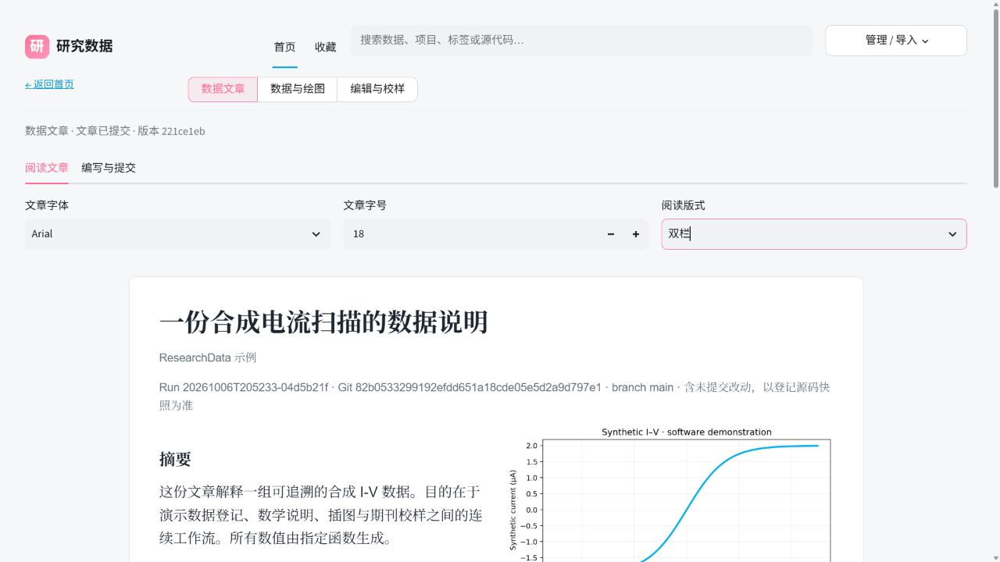
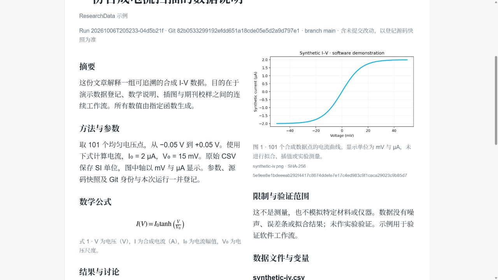
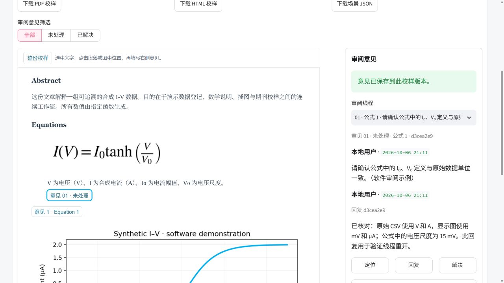

# 数据文章与正式提交（v0.6）

数据登记和正式提交是两个阶段。`run`/`finish` 只记录执行结果，保留输出和来源；它们不是正式提交，也不代表科学验证通过。正式交付必须有可验证的文章提交 receipt、`run_id` 和 `revision_id`。

## 标准流程

先为已完成的运行生成模板，再编辑 UTF-8 JSON：

```powershell
research-data article template --run-id RUN_ID --output article.json
# 编辑 article.json
research-data article save --run-id RUN_ID --file article.json
research-data article check --run-id RUN_ID
research-data submit RUN_ID --article article.json
research-data article status --run-id RUN_ID
```

`article` 的 `--run-id` 是必填项；`save` 和 `check` 使用 `--file`，`submit` 使用位置参数 `RUN_ID` 和可选的 `--article`、`--expected-hash`。实际参数以 `research-data help article --json`、`research-data help submit --json` 和 `research-data guide article --json` 为准。

Python API 在已有 `Run` 上提供相同操作：

```python
from research_data import Catalog

catalog = Catalog("D:/research-data-library")
with catalog.run(title="S17 transport", description="registered measurement") as run:
    artifact = run.add_artifact("results/curve.csv", description="ordered I-V scan",
                                profile={"x": "voltage", "units": {"voltage": "V", "current": "A"},
                                         "descriptions": {"current": "measured current"}})
article = {
        "schema": "research-data.article.v1",
        "title": "S17 transport", "authors": ["A. Researcher"],
        "summary": "Summary supported by the registered run.",
        "methods": "Describe the recorded method and processing.",
        "results": "Report only values present in the managed artifacts.",
        "limitations": "State missing checks and scope limits.",
    "datasets": [{"artifact_id": artifact["artifact_id"], "description": "ordered I-V scan",
                  "variables": "voltage (V), current (A); acquisition order retained"}],
    "equations": [],
    "equation_note": "No equation is used in this data description.",
    "figures": [],
    "figure_note": "No managed PNG/JPEG figure is included in this article.",
    "references": []}
receipt = run.submit(article)
print(receipt["receipt"]["run_id"], receipt["receipt"]["revision_id"], receipt["path"])
```

`run.submit` 必须在 `with catalog.run(...)` 结束之后调用，以便 execution status 已经是 `completed`。示例使用实际返回的 artifact ID，并明确说明没有公式和图片；若文章确实使用公式或图片，替换为实际受管条目及其描述。不能从文件形状、常识或图像外观臆造单位、公式、数值或结果。

## 完整性门

提交时必须填写 `title`、`summary`、`methods`、`results` 和 `limitations`。每个受管数据文件都必须在 `datasets` 中出现，并有非空 `description` 以及变量、单位和顺序说明。缺少变量或单位时明确写 `unknown / units not recorded`，不能猜测。

文章至少要提供带描述的公式，或在 `equation_note` 明确说明公式不适用；至少要提供带 caption 的受管 PNG/JPEG 图，或在 `figure_note` 明确说明图不适用。公式使用原始 MathText/有限 LaTeX 子集，不要写 `$` 或 `$$` 分隔符；离线渲染使用 Matplotlib，需安装 `research-data[ui]`。参见 [Matplotlib MathText](https://matplotlib.org/stable/users/explain/text/mathtext.html) 和 [MathText API](https://matplotlib.org/stable/api/mathtext_api.html)。完整 LaTeX 文档、TeX 执行和 CDN 不在此支持范围内。

`check` 和 `submit` 会重新检查当前受管文件、源码快照、公式和图片。成功提交会冻结 `article.json` 与 receipt；`article status` 用保存的草稿哈希和 manifest/provenance 元数据快速判断是否为 `stale`，其结果标记 `integrity_checked: false`。直接修改受管文件的原始字节不会由 `status` 完成完整校验，需运行 `article check` 或 `submit`，它们会发现哈希不一致。receipt 是提交证据，不是科学验证；验证状态仍通过独立证据记录。

## 阅读与校样

数据文章页面支持字体、字号和单栏/双栏阅读。`文章排版` 可把已提交文章带入现有图形场景，生成带冻结公式和图片资源的新校样；原校样及其评论、线程和 revision 保持不变。校样的冻结 HTML/PDF 使用提交时的字节和哈希，旧 proof 不会被重新渲染。

公式、插图与图注支持独立评论定位；回复继承原线程的位置，向已解决线程回复会重新打开它。点击页面选取的位置会直接用于提交意见。

下面是实际浏览器中的合成示例，仅用于软件工作流验证：







可下载 [示例 PDF 校样](article-proof-example.pdf) 或 [冻结 HTML](article-proof-example.html)。PDF 同时使用可用的中文字体与嵌入的拉丁字体；具体中文字体取决于运行系统，排版后应检查导出文件。
