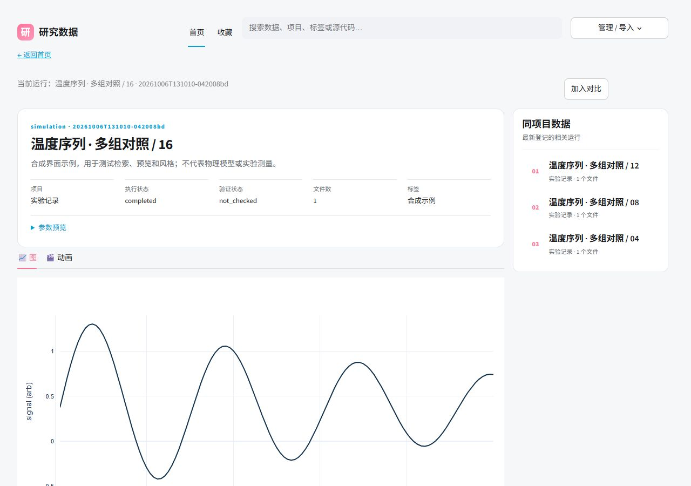

# 浏览数据与绘图

双击 Windows 的 `Start-ResearchData.cmd`，或运行：

```text
research-data open
research-data open --project-dir D:/my-project
research-data help open
research-data guide browse --json
```

浏览器中的界面使用本地 catalog；上方“管理 / 导入”可切换目录、项目模板和导入 profile。
命令启动会报告真实 URL；默认优先使用 `http://127.0.0.1:8765/`。


## 首页

- 顶部搜索标题、描述、标签和来源信息；项目分区可单独筛选。
- “推荐”按项目轮流展示各项目的新运行；“最新”“最早”“最多文件”分别按登记时间或文件数排序。
- 每页 12 张卡片。标题、说明、项目、状态、登记日期和文件数来自 catalog。
- 封面标明“模型示意”“数据预览”或“参数预览”。示意图和缩略图用于导航，科学结论需查看实际数据与验证记录。
- 收藏入口只显示本机收藏。侧边“文件排行”按真实登记文件数排列。
- 卡片和相关数据链接携带当前 catalog 与项目模板目录；搜索会回到当前目录的结果页。

## 独立详情页

点击卡片先查看完整说明、参数、自动图表或登记的图片/动画。“运行详情 / 来源与参数”
可展开 Git commit、生成时的分支、入口、环境与实际源码快照；还可下载文件、收藏、评论及记录 review 请求。
右侧“同项目数据”可直接跳到相关运行，顶部可回首页。

下方保留数据加载、变量和切片、对比、绘图配方、字体/字号、线宽、网格和图例编辑。
项目自定义多面板结构继续使用 `research-data.project.json`，详见 [项目模板](PROJECT_TEMPLATES.md)。
改变绘图风格不会改变源数据；保存的分析图关联当时的输入、配方和绘图源码。



## 数据文件详情

点击卡片进入文件列表，按文件名、说明或变量搜索；选中文件后自动读取。选择一个输出变量，可查看它的坐标名称、单位、说明和形状。右侧“同项目数据”可打开相关运行；对比输入按登记时间排列，其他运行使用各自的默认文件。

查看区提供“图表 / 数据表 / 变量与文件详情 / 动画”。表格最多预览 100 个值与对应的坐标或 `dim_index`，不把整个 xarray Dataset 展开成表格。二维数值变量默认绘制热图；三维及以上使用最后两个维度，前面的维度默认取首个索引，可调整切片。缺少明确的坐标或轴映射时，先显示表格。

可直接选择预览风格和字号；点击“在绘图编辑器中使用”带入当前配方，再调整字体、线宽、面板或项目模板。切换文件或变量会清除旧的生成图；登记分析图记录实际输入文件的哈希。日志、图片和配方也可选中并下载。文件读取器会完整加载选中文件，目前不提供分块读取。

这个参数树式的“先看参数与依赖、再取所需数据”交互参考了 QCoDeS 的
[Accessing data in a DataSet](https://microsoft.github.io/Qcodes/examples/DataSet/Accessing-data-in-DataSet.html)。


界面在桌面显示多列卡片，在窄屏改成单列；导航、搜索和管理入口竖排。
首页截图使用 16 份衰减正弦数据；文件浏览器截图使用两次运行、每次四个文件的合成数据。它们仅用于验证软件界面。

运行环境使用 Streamlit 1.65+，包括原生分页控件；包安装会解析相应 UI 依赖。
