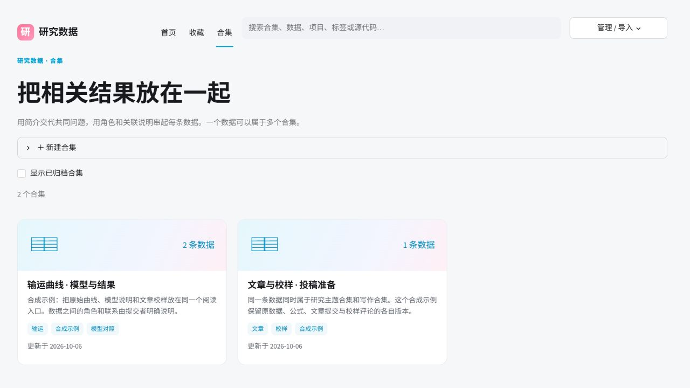
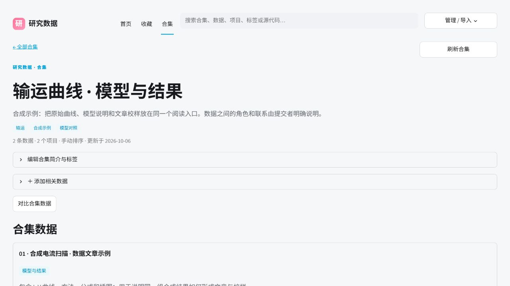

# Collections

Collections are explicit, reference-only groups of catalog runs. A collection
can contain many runs and a run can belong to many collections. Creating or
editing one does not copy, move, rewrite, or reinterpret a run: source files,
Git provenance, data articles, and proofs remain attached to their original
run. Use a title, description, tags, and per-member `--role`/`--note` to state
the relation that you actually know. ResearchData does not infer scientific
causation or automatically group runs into a catalog.

Create a collection with ordered initial members:

```powershell
research-data --root D:/research-data-library collection create `
  --title "Cooldown comparison" `
  --description "Reference-only set for the same measurement campaign" `
  --tag transport --tag comparison `
  --run RUN_ID_1 --run RUN_ID_2
```

The command returns collection metadata, a stable `collection_id`, a content
`hash`, and `members` with `run_id`, `role`, `note`, and `added_at`. Placeholder
IDs in examples stand for IDs returned by `run`, `import`, or `show`.

Use these operations:

```text
collection list [--query TEXT] [--include-archived]
collection show --id COLLECTION_ID
collection edit --id COLLECTION_ID [--title TITLE] [--description TEXT]
                 [--tag TAG ... | --clear-tags] [--expected-hash HASH]
collection add --id COLLECTION_ID --run-id RUN_ID [--role ROLE] [--note NOTE]
               [--expected-hash HASH]
collection remove --id COLLECTION_ID --run-id RUN_ID [--expected-hash HASH]
collection reorder --id COLLECTION_ID --run RUN_ID --run RUN_ID ...
                   [--expected-hash HASH]
collection archive --id COLLECTION_ID [--expected-hash HASH]
collection restore --id COLLECTION_ID [--expected-hash HASH]
collection memberships --run-id RUN_ID [--include-archived]
```

`reorder` requires the exact current member permutation, including every
member once. Mutation commands can pass the hash from the last read with
`--expected-hash`; a changed hash produces an error instead of overwriting a
concurrent edit. `remove` only removes the reference. If a referenced run is
historical or missing, its member entry remains visible so the relationship
is not silently lost.

For scripts and agents, inspect the parser contract with
`research-data help collection --json` and the workflow decision map with
`research-data guide collection --json`. Add `--output FILE.json` to write any
collection result as UTF-8 JSON. The Web catalog exposes a 合集 entry and each
run exposes its 所属合集 memberships.

In a collection, **对比合集数据** selects the first six available runs and
opens the plotting workspace. Click **加载所选运行** there to load the selected
files, then choose compatible variables and a reusable plot recipe.




