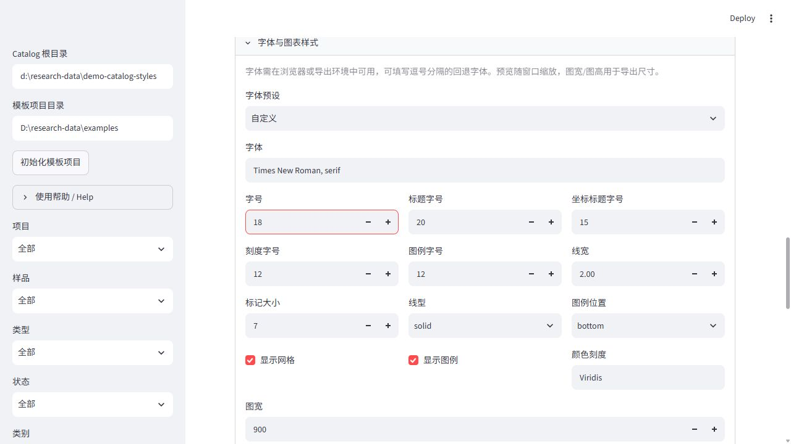

# 项目模板与可视化编辑

ResearchData 是本地 Web 应用：双击 Windows 桌面快捷方式或运行
`research-data open` 即可打开。Catalog 数据目录与模板项目目录分别选择；
运行记录的 `project` 分类名称不是磁盘路径。

## 调研依据

2026-10-05 查阅官方资料；以下是设计依据，不是性能比较。

| 工具 | 启动及界面 | 本项目采用的做法 |
| --- | --- | --- |
| [MLflow CLI](https://mlflow.org/docs/latest/api_reference/cli.html) | 命令启动本地服务，浏览器查看运行和产物 | 保留 open/status/stop 和明确的数据目录 |
| [Plottr](https://github.com/toolsforexperiments/plottr) | Qt 应用，用户定义数据处理和绘图流程 | 将数据映射与绘图配方分开保存 |
| [W&B line plot](https://docs.coreweave.com/products/wandb/app/features/panels/line-plot/reference) | 面板设置组织轴、图例和显示选项 | 集中的外观设置面板 |
| [Plotly templates](https://plotly.com/python/templates/) | 模板定义字体、布局和 trace 外观 | 默认风格加可保存的项目配置 |

## 界面操作

1. 选择运行，点击 **加载所选运行**，选择变量、图形和默认风格。
2. 展开 **字体与图表样式** 调节字体、各类字号、线宽、点大小、线型、网格、图例位置及图尺寸。
3. 点击 **生成图表**。之后修改设置会更新预览；下载或登记的配方对应当前显示的图。
4. 侧栏填写 **模板项目目录**，初始化或读取该目录的 `research-data.project.json`。
   在 **保存 / 载入配方** 中选择 `project:NAME` 并应用模板。
5. **保存当前配方** 保存到 Catalog；**保存到项目** 写入项目 JSON。
   覆盖已有项目名称需明确勾选允许覆盖。将 JSON 和源代码一起提交到 Git。

**高级配方 JSON** 可以编辑多面板和受支持的 Plotly 布局。


字体来自浏览器/导出运行环境，可填写回退序列，如
`Times New Roman, Noto Serif CJK SC, serif`；字号单位为 px。

## 命令

```text
research-data project init --project-dir D:\my-science-project
research-data open --project-dir D:\my-science-project
research-data project show --project-dir D:\my-science-project
research-data project check --project-dir D:\my-science-project
research-data import result.csv --title "transport scan" --profile project:transport --project-dir D:\my-science-project
research-data plot RUN_ID --recipe project:response --project-dir D:\my-science-project --output response.svg
research-data project save-plot --project-dir D:\my-science-project --name response --recipe response.json
research-data help project --json
research-data guide customize --json
```

CLI 的 `--project-dir` 默认取 `RESEARCH_DATA_PROJECT` 或当前目录。
`project check` 检查配置结构和外观字段；实际变量、形状、单位兼容性及对数轴数据
是否合法，由加载和绘图时检查。初始化拒绝覆盖已有文件。

## 项目文件

完整例子见 [research-data.project.json](../examples/research-data.project.json)。

```json
{
  "schema": "research-data.project.v1",
  "profiles": {
    "transport": {"x": "bias", "rename": {"raw_current": "current"},
      "units": {"bias": "V", "current": "A"}}
  },
  "plots": {
    "response": {"kind": "panels", "columns": 2, "theme": "paper",
      "style": {"font_family": "Times New Roman, serif", "font_size": 16},
      "panels": [
        {"x": "bias", "y": "current", "component": "real", "title": "Real"},
        {"x": "bias", "y": "current", "component": "imag", "title": "Imaginary"}
      ]}
  }
}
```

`profiles` 映射数据到统一 xarray 结构，支持 `x`、`rename`、`units`、
`descriptions`、`variables`、`coordinates`、`format` 和 QCoDeS GUID/run ID。
数组的 `coordinates` 是变量到有序维度名列表，如 `{"signal":["time","bias"]}`。
变量含义和单位需要由实验者或计算代码声明。

普通 `plots` 支持 line/scatter/compare/complex/heatmap，字段为 x/y/z/y_axis、
component、整数索引 slices、log_x/log_y、title、x_label/y_label、width/height。
`panels` 组合最多 12 个普通配方，columns 为 1–4。每个面板可以用
`dataset_indices: [0,1]` 指定输入运行，独立坐标轴，不隐式排序、插值、归一化或
转换单位。面板不能嵌套。

`style` 支持 font_family/font_size/title_size/axis_title_size/tick_size/legend_size、
line_width/marker_size/line_dash、show_grid/show_legend、
legend_position（bottom/right/top）、colors（颜色列表）、colorscale。
面板继承外层风格，并可覆盖自身曲线和轴文字设置。

`layout` 支持 paper_bgcolor、plot_bgcolor、font、margin、title、legend、
annotations、shapes、width、height。对应 style 设置最后生效。
子面板的 layout 不支持 annotations/shapes；放在最外层或单图配方中。
科学轴类型和数据操作通过配方明确指定。

## Agent 与来源追踪

Agent 先读 `help --json` 和 `guide customize --json`，按项目变量和单位修改
profiles/plots，执行 `project check`，再使用 `project:NAME`。
特殊读取或科学图仍可在项目自己的 Julia/Python 脚本实现，用 run/register 将数据、
图、脚本和配置纳入 Catalog。浏览器读取模板或来源文件不会执行脚本。

```python
from research_data.project import ProjectTemplates
from research_data.plotting import render_plot, export_plot

templates = ProjectTemplates("SOURCE_ROOT")
run.add_artifact("result.csv", profile=templates.profile("transport"))
fig = render_plot([dataset], templates.recipe("response"))
export_plot(fig, "response.svg")
```

解析后的模板携带原始文件内容、SHA-256、Git 提交、分支和 dirty 状态。
artifact 保留实际采用的 profile；分析图保留输入 ID/哈希和完整配方。
文件后来变化，已登记配方仍可独立重放。模板版本描述映射/绘图配置；
数据生成代码的版本保留在输入运行的 provenance 中，两者分别记录。
