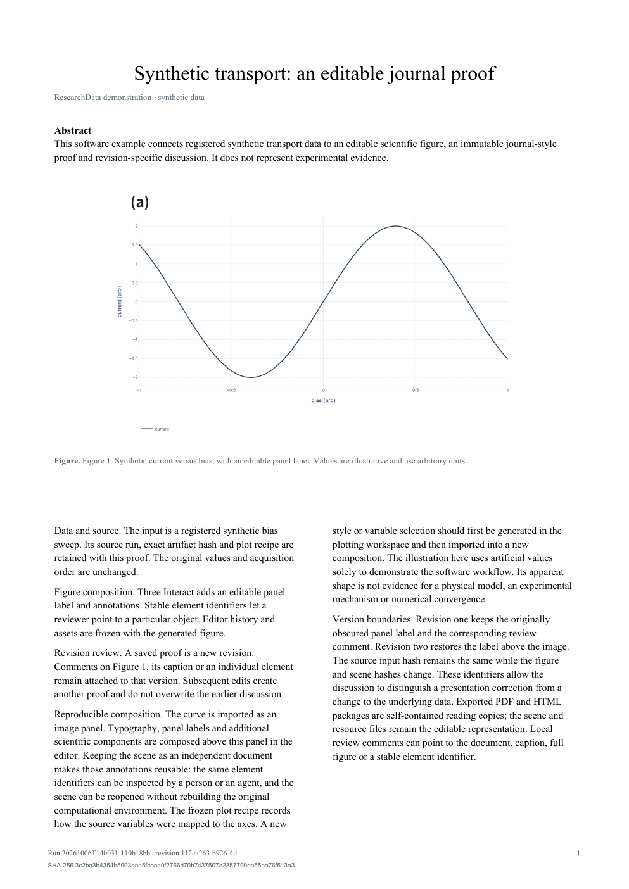

# 编辑与校样

数据详情页的“工作区 编辑与校样”把当前数据图交给内置的编辑与校样工作区。点击“从当前数据图创建草稿”后，工作区内的“图形编辑”“文章排版”“校样审阅”三个页签保持挂载，因此图形自动保存或发布校样时切换页签不会丢失进行中的状态。图形编辑页使用内置的 Three Interact 编辑器，可移动或添加标签、形状、图片、组件和 3D 视口；编辑器随软件打包，运行时不需要 VS Code、Node 或单独的 Three Interact 服务。

工作区入口位于运行详情前方，滚动时保持可见。从已发布校样卡片进入时，界面核对来源清单后打开源运行的草稿与全部直属版本，并在“校样审阅”中选中该卡片对应的精确 owner revision；生成的校样卡片默认打开“校样审阅”。点击“打开源数据与全部校样”可直接返回源运行；在审阅页的“查看校样版本”中选择对应版本。

绘图工作区先决定数据轴、字体、字号、图例和面板布局，再把结构化图形送入校样编辑器。曲线、每个位点、坐标刻度、标题、图例和热图单元格均是独立场景元素，可以直接点击或从元素树检索、修改、移动。修改只影响展示，原始数据值和绘图 recipe 保留。SVG 和期刊校样 HTML/PDF 使用编辑后的场景。只有 PNG/JPEG 的输入仍作为一张图片；有冻结输入和配方的旧草稿提供明确的升级按钮。详见[独立元素绘图](editable-plots.md)。

在“文章排版”中填写标题、作者、摘要、正文和图注，选择 `single` 或 `double`。点击“保存并生成校样”时，浏览器会把当前场景、资源、编辑历史、组件版本和对应 PNG 一起提交。展开“草稿文件与编辑器信息”可下载草稿、重新载入草稿并查看编辑器信息；保存的草稿仍位于 catalog 的 `proofs/<run-id>/draft.json`，一次发布产生一个新的不可变 revision。

图形编辑会自动保存；文章表单需点击“保存文章内容”。保存和生成期间会显示当前阶段并禁用重复提交，等待本地服务确认后恢复按钮。生成完成会显示新版本 ID；错误保留当前画布，按提示恢复后可重试。

每个 revision 包含 `report.html`、`report.pdf`、`scene.json`、`document.json`、`assets.json`、`recipe.json`、`figure.png` 和 manifest，并可包含 Three Interact vendor 快照。输入运行、artifact SHA-256、生成源码和编辑器身份都冻结在 revision 中。校样审阅页左侧读取冻结的文章和图形，右侧显示定位评论；窄屏时两栏上下堆叠，下载入口位于审阅内容上方。单栏和双栏是通用的期刊校样版式，下载的 PDF / HTML 保持原稿内容。

评论必须带精确锚点：`document`、`title`、`abstract`、`body`、`caption`、`figure` 或 `element:UUID`。回复使用同一个 revision 和父评论 ID。评论只记录本地编辑意见，不改变数据完整性或科学验证状态，也不会自动发送消息或调度 agent。

## 定位与处理意见

1. 在“校样审阅”选好版本。在左侧选中同一段落内的文字，或直接点击段落；点击图中位置可放置一个标记。也可展开“图形元素”按名称和稳定 ID 选择元素。
2. 右侧显示所选原文或图中坐标。填写“校样评论”并提交，意见会绑定这个 revision。文字范围采用 Unicode 字符计数，图中点采用 0–1 相对坐标，因此缩放窗口后位置仍对应同一张冻结图。
3. 点击高亮、编号标记，或从“审阅线程”选择意见。“定位”回到其原文位置，“回复”沿用同一位置。
4. 点击“解决”标记线程已解决。通过“全部 / 未处理 / 已解决”筛选查看；“重新打开”可恢复未处理状态，向已解决线程添加回复也会重新打开它。处理记录保留操作者、时间、状态和说明。

评论与状态只写入该版本的 `comments.json`，不会改写 manifest、图形或 PDF / HTML。旧评论没有状态时显示为未处理，仅阅读不会迁移旧文件。旧版意见不会自动搬到新版；改稿后生成新校样，再分别核对各版本。文字跨段落选取会提示改为单段选择，避免保存错误的位置。

定位和解决流程参考 [Overleaf 评论说明](https://docs.overleaf.com/collaborating/commenting)。文字引用加字符范围借鉴 [W3C Web Annotation 选择器](https://www.w3.org/TR/annotation-model/#text-position-selector)；本地 locator 是简化结构，没有声明完整 W3C 格式兼容。



可直接下载这个合成数据示例的 [PDF](proof-example.pdf) 或打开 [HTML](proof-example.html)。被底图遮住的标注可选中后点击“置于顶层”；保存和重新载入会保留图层顺序。

开发时可在安装了 Plotly 的包环境中执行 `node scripts/vendor-three-interact.mjs ../three-interact`，从兄弟项目重新构建编辑器，并记录上游 Git 版本、资产哈希和许可证。可用 `RESEARCH_DATA_PYTHON` 指定维护用 Python 路径。普通用户使用已打包资产即可。

## Agent CLI

先让实际安装的 parser 给出当前选项：

```powershell
research-data help proof --json
research-data guide proof --json
```

读取草稿并保存到文件，结果中记录 `hash`：

首次创建前，`proof show` 返回 JSON `null`，表示尚无草稿。先在浏览器中从当前数据图创建草稿，再使用以下 CLI 编辑流程。

```powershell
research-data proof show --run-id RUN_ID --output draft.json
research-data proof save --run-id RUN_ID --draft draft.json --expected-hash DRAFT_HASH
```

`save` 使用乐观哈希，避免覆盖另一个编辑者刚保存的草稿。发布时必须提供与当前场景对应的 PNG；如果草稿没有当前图，`--figure` 是必需的：

```powershell
research-data proof publish --run-id RUN_ID --draft draft.json --figure matching.png
```

查看 revision、评论和完整性：

```powershell
research-data proof list --run-id RUN_ID
research-data proof comments --run-id RUN_ID --revision REVISION_ID
research-data proof check --run-id RUN_ID --revision REVISION_ID
```

添加图注评论、元素评论和回复：

```powershell
research-data proof comment --run-id RUN_ID --revision REVISION_ID --anchor caption --text "请说明误差条来源。"
research-data proof comment --run-id RUN_ID --revision REVISION_ID --anchor element:UUID --text "保持该标签与结点对齐。"
research-data proof comment --run-id RUN_ID --revision REVISION_ID --anchor figure --text "已复核校样。" --reply-to COMMENT_ID
research-data proof comments --run-id RUN_ID --revision REVISION_ID --status open
research-data proof comment-status --run-id RUN_ID --revision REVISION_ID --comment-id COMMENT_ID --status resolved --note "图注已确认。"
research-data proof comment-status --run-id RUN_ID --revision REVISION_ID --comment-id COMMENT_ID --status open --note "需要再次核对。"
```

带具体位置的评论使用 `--locator locator.json`。文本例：`{"kind":"text","start":0,"end":5,"exact":"Hello"}`，需同时指定对应文本 `--anchor`，范围与引用必须匹配冻结文档。图中点例：`{"kind":"point","x":0.25,"y":0.6}`，使用 `--anchor figure`。回复继承线程原来的锚点和定位；线程状态作用于根评论及全部回复，`--comment-id` 可为其中任一评论 ID。

校样功能由 `ui` extra 提供 ReportLab PDF；Plotly 导入和 Three Interact 已随浏览器界面打包，不需要额外的 Chrome、VS Code 或 Node 服务。校样版式直接生成 HTML/PDF，不要求 LaTeX。发布会在本地建立新的 analysis run，保留源运行、输入 artifact SHA-256、编辑器和源码快照。它不会把数据或校样发布到 GitHub；原始运行和旧 revision 保持不变。
