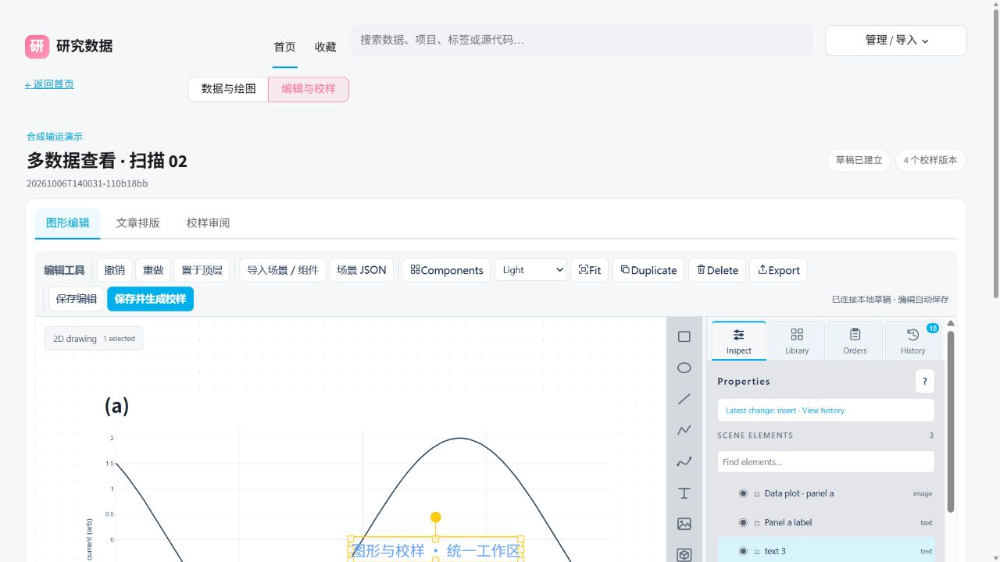
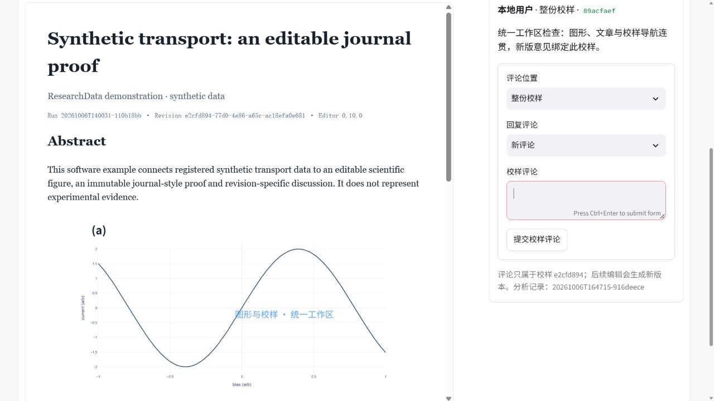

# Unified figure and proof workspace

ResearchData 0.5.2 integrates figure editing, article layout and proof review into one workspace. Open a run and select **编辑与校样**; use **图形编辑 / 文章排版 / 校样审阅** to move through the workflow. Generated proof cards open their owner's exact revision in the review pane.

The editor defaults to a light theme matching the browser. A single grouped toolbar contains editing, import, theme and save controls. Dark themes remain selectable and the selected theme persists locally. Draft files, reload and engine information live in the **草稿文件与编辑器信息** drawer. General data discussion is collapsed separately from comments on an exact proof revision.

All three panes remain mounted when switching tabs, so a pending inspector edit or canvas autosave can finish. Article content still requires **保存文章内容**. Save/publish controls retain their acknowledgment and duplicate-submission protection. Review places the journal reading copy beside the comments, with PDF/HTML/scene downloads above; narrow windows stack the review panes.

## Design references

Primary public pages inspected on 2026-10-06:

- [BioRender features](https://www.biorender.com/features) describes matching colors, labels and axes across graphs and a consistent design language. Its public page also shows a unified application canvas and toolbar. We used this as a visual consistency reference; its authenticated editor was not tested.
- [Vitessce documentation](https://vitessce.io/docs/) describes configurable visualization/control views with shared coordination. We applied the idea of views sharing one data context to the figure, article and revision panes. This is a design inference, not a claim that ResearchData implements Vitessce's data model.

No third-party account or paid service is needed. The upstream Three Interact editor remains vendored with its provenance and license; the integration changes the host chrome and ResearchData layout.

## Validation

Focused regression checks cover generated-card owner/revision navigation, article saves preserving scene IDs and frozen revisions, revision-specific comments, HTML escaping and packaged asset hashes. Browser checks use synthetic catalog data, exercising component access, theme selection, editing followed immediately by a tab switch, article save, proof publication and review. Scientific validation status is unchanged by presentation or software checks.

