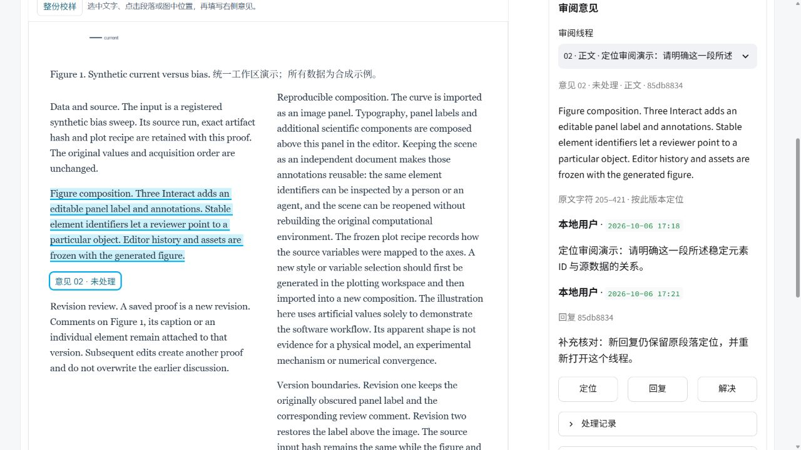
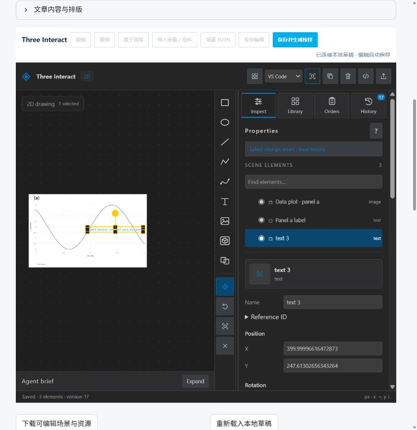
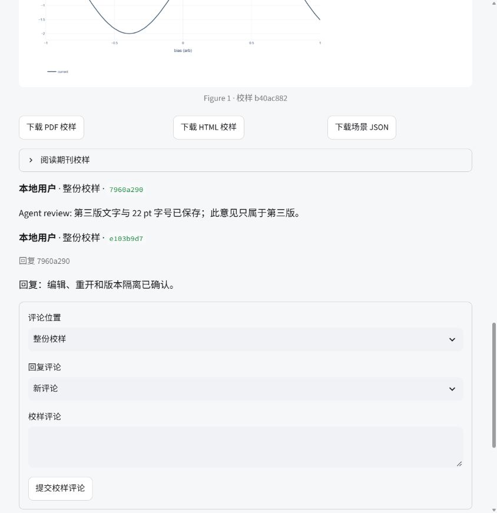
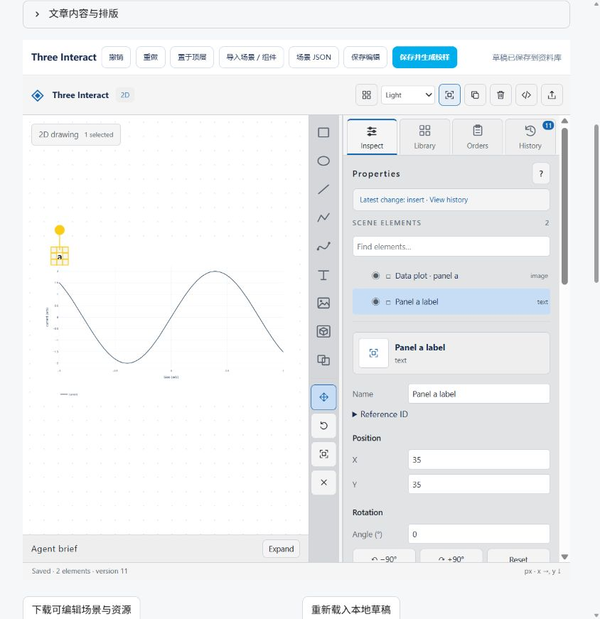
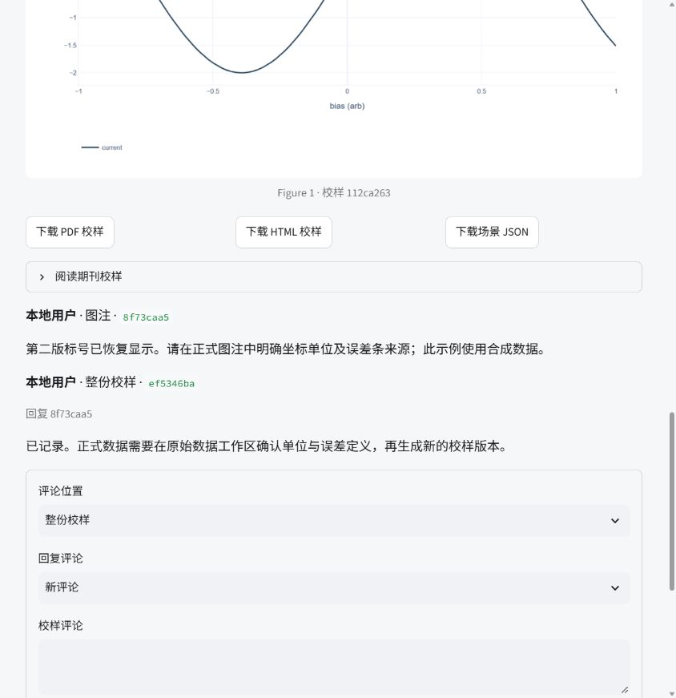
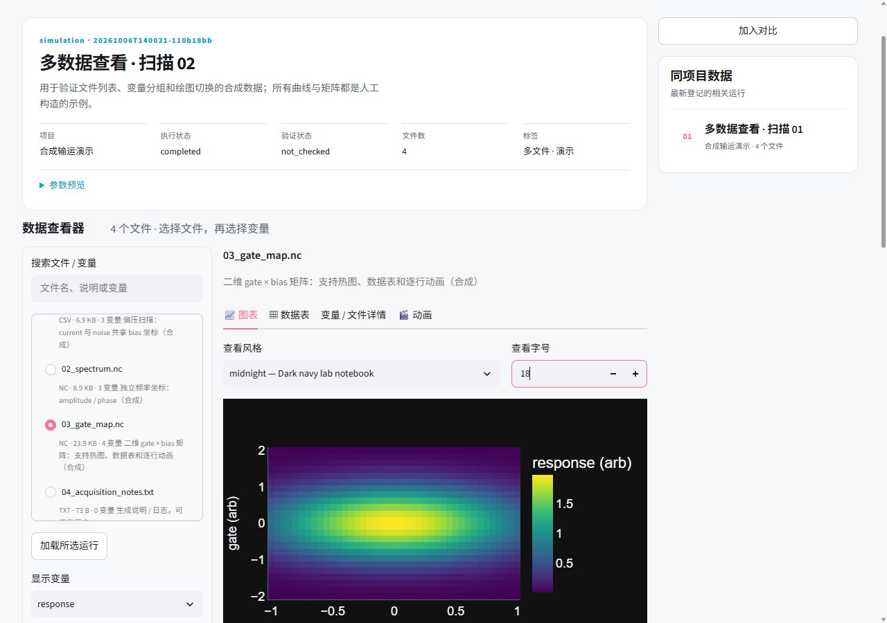
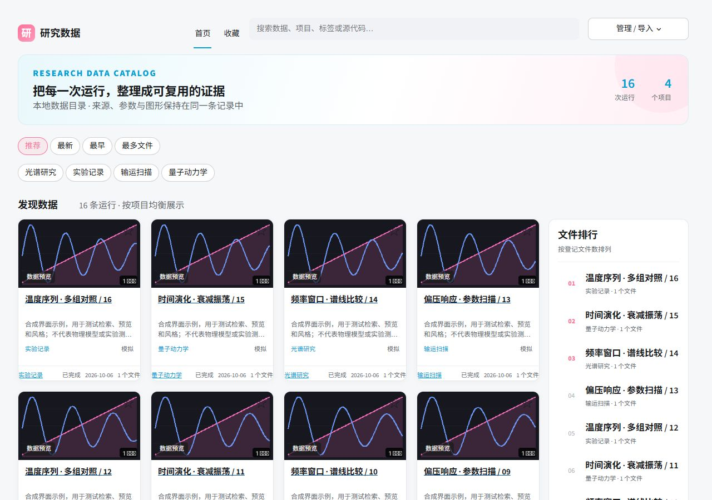
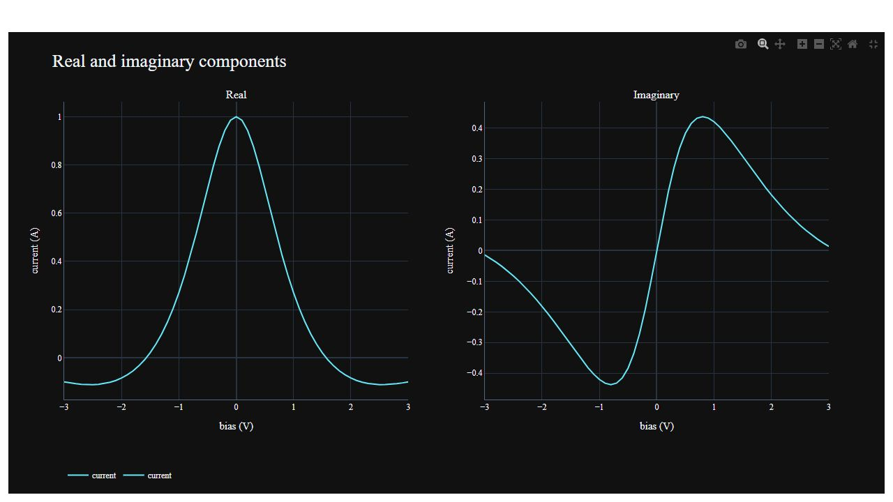
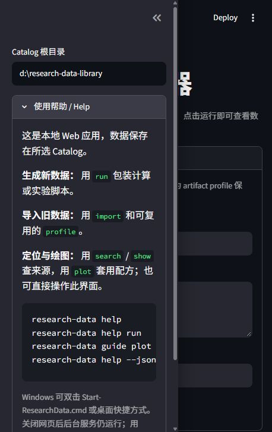

# 0.7.1 跨平台并发测试修正

0.7.0 的 Linux CI 发现并发测试把按输入顺序返回的最后一个线程快照误当成最终持久化结果。0.7.1 在所有线程完成后重新打开合集，断言所有成员仍在，并检查每个线程返回的快照包含其自身添加的成员。原有受管文件保留断言仍执行；合集存储与界面行为未改动。最终跨平台执行见 [0.7.1 release](https://github.com/fangrh/research-data/releases/tag/v0.7.1) 的对应 Actions。

# 0.7.0 关联数据合集验证

2026-10-07，Windows / Python 3.13.12 / Streamlit 1.65.0。使用方式见 [合集](COLLECTIONS.md)。

| 验证 | 结果 |
|---|---|
| 完整回归 | 140 passed，1 skipped，347.42 s；Windows 缺少符号链接创建能力，相关测试在支持的环境执行。既有 HDF/NetCDF NumPy ABI warning 保留，值与坐标断言通过 |
| 合集存储 | 多对多引用、角色与关联说明、检索、排序、归档恢复、缺失成员保留、原子写入、并发添加不丢失、过期 hash 拒绝 |
| 页面操作 | 合成目录实际创建两个合集，共享数据文章示例；添加说明、移序、移出并重新加入、文章与已有校样入口、绘图对比选择、归档恢复与标题检索 |
| 受管内容保留 | 操作前记录的 179 个运行目录文件，操作后逐一 SHA-256 一致；包括原数据、源码、文章及历史校样。合集另存为引用记录 |
| 最终界面检查 | 文案澄清后，UI 4 passed，27.08 s；480 px 合集索引为单列，索引及详情的 clientWidth / scrollWidth 均为 480；已恢复默认窗口 |

界面与安装包最终证据、公开资源及 Windows/Linux CI 见 [公开 release](https://github.com/fangrh/research-data/releases/tag/v0.7.0)。合集组织说明不判断科学关联或验证结论；现有文章提交门、Git 身份、谱系与校样意见保持独立。

# 0.6.0 数据文章与正式提交验证

2026-10-06 / 07，Windows / Python 3.13.12 / Streamlit 1.65.0。结构及命令见 [数据文章](ARTICLES.md)。

| 验证 | 结果 |
|---|---|
| 完整回归与最终补充 | 129 passed，151.09 s；随后补充手动公式定位菜单，相关 UI 4 passed，17.91 s。既有 HDF/NetCDF NumPy ABI warning 保留，值与坐标断言通过 |
| 提交门与检索 | 缺项拒绝、逐数据文件说明、原始文件/源码快照校验、可验证 receipt、草稿及 manifest 变更 stale、重新提交保留旧 receipt、中文说明检索 |
| 文章与校样 | 离线 MathText、受管 PNG/JPEG 及图注、冻结公式/图片与原文章 receipt、非法公式及跨运行图片拒绝；旧 proof 读取兼容 |
| 实际浏览器 | 合成运行 20261006T205233-04d5b21f 提交文章 221ce1eb；带入草稿；最终校样 a84c675c；公式评论 d3cea2e9 定位正确，解决后回复继承定位并重新打开 |
| 字体与窄窗口 | Arial / 18 px 实际应用；双栏在 480 px 自动单栏，文档 clientWidth / scrollWidth 均为 480；来源与登记参数可见；测试后恢复窗口 |
| PDF 目视检查 | 中文、全角标点、拉丁文字、负号、μ 与下标可读；公式比例、图注及一页排版已渲染检查，示例附于 ARTICLES.md |

所有浏览器写入仅使用合成示例目录。正式提交检查结构与来源完整性，不判断文章事实或科学结论是否正确。`run` / `finish` 保存执行结果；只有成功的 `submit` receipt 代表正式交付。安装包审计与 Windows/Linux CI 以 [公开 release](https://github.com/fangrh/research-data/releases/tag/v0.6.0) 及对应 Actions 为准。

# 0.5.3 定位审阅与意见处理验证

2026-10-06，Windows / Python 3.13.12 / Streamlit 1.65.0。工作流、定位结构及来源见 [定位审阅](PROOF_REVIEW.md)。

| 验证 | 结果 |
|---|---|
| 完整回归 | 111 passed，197.92 s；既有 HDF/NetCDF NumPy ABI warning 保留，值与坐标断言通过 |
| Windows CLI 补充修复 | 2 passed；真实 GBK 子进程创建带 emoji 的引用评论，输出 JSON 可解析且持久化文本不变；UTF-8 输出保持可读 Unicode |
| 定位及版本边界 | Unicode 字符范围和 exact 原文核对；非法定位和跨版本回复拒绝；旧评论读取不重写侧文件；线程继承位置和状态 |
| 实际浏览器 | 创建正文评论 85db8834（205–421）、图中评论 68118586（约 50% / 50%）；原生拖选短句得到 423–441；编号跳转、解决筛选、回复重开和直接重开通过 |
| 冻结内容 | 合成目录中 4 个旧版本的 36 个冻结文件与操作前 SHA-256 全部一致；意见及状态仅更新独立评论文件 |
| 窄窗口 | 480 px 阅读与讨论上下排列，clientWidth / scrollWidth 均为 480；图中编号随图缩放；测试后恢复默认窗口 |
| 独立 CLI 使用 | 无 UTF-8 环境覆盖，help/guide、emoji 引用、回复、按状态筛选及解决/重开通过；跨版本回复退出码 2，原校样完整性保持 |

所有浏览器写入使用合成示例。完整测试与随后两个编码修复测试分开记录；最终安装包审计和 Windows/Linux CI 见对应 [公开 release](https://github.com/fangrh/research-data/releases/tag/v0.5.3) 与 Actions。处理状态是编辑意见状态，不代表科学验收。

# 0.5.2 统一工作区验证

2026-10-06，Windows / Python 3.13.12 / Streamlit 1.65.0。设计来源和截图见 [统一工作区](UNIFIED_WORKSPACE.md)。

| 验证 | 结果 |
|---|---|
| 完整回归 | 104 passed，223.10 s；既有 HDF/NetCDF NumPy ABI warning，值与坐标断言通过 |
| 最终导航修改 | 5 passed，21.24 s；来源版本、文章保存保留 scene 和旧校样、评论隔离、HTML escaping |
| 浏览器工作流 | 修改文字后立即换页仍自动保存；文章保存保留当前页；校样生成等待确认并禁用重复提交；第四版 e2cfd894 及评论 89acfaef 实际创建 |
| 工具栏 | 一层工具栏；实际打开组件库；所选元素 Duplicate 可用；原编辑器标题隐藏；save/publish 状态协议保留 |
| 主题与窄窗口 | 默认浅色；黑色主题前景/背景可读；480 px 审阅区上下排列，页面宽度与 scrollWidth 均为 480；测试后恢复窗口尺寸 |

所有写入检查仅使用合成数据目录。旧校样及其评论保留；这些是软件行为证据。

# 0.5.1 独立 agent 使用、反馈与修复验证

2026-10-06，Windows / Python 3.13.12 / Streamlit 1.65.0。两个 Luna agent 分别实际使用 UI 与 CLI；合成目录隔离于用户资料库。原始报告与修复对应表见 [独立评审](AGENT-REVIEW.md)。

| 验证 | 结果 |
|---|---|
| 完整回归 | 104 passed，154.97 s；既有 NetCDF/NumPy ABI warning 保留；最终改动区域 7 passed，17.92 s |
| 独立安装包 | site-packages 0.5.1；9 个编辑器资产哈希、runtime/distribution、校样来源、中文 PDF、评论、JSON 帮助和服务启动/复用/停止通过；39 个包文件与源代码、wheel、sdist、已安装版本逐字节一致 |
| 实际编辑和保存 | 连续修改文字和字号后立即保存；最终文字与 22 pt 保留，按钮等待服务确认，重开仍为草稿 version 17 |
| 校样来源导航 | 从已生成校样卡片定位源运行草稿、显示全部直属版本并选中精确版本；篡改来源清单拒绝 |
| 生成与评论 | 新版本 b40ac882 实际生成 PDF/HTML/PNG；评论 7960a290 和回复 e103b9d7 属于第三版，第一版原评论及第二版评论保留 |
| 版本保护 | 自动保存单次在途，显式保存等待确认及最新草稿哈希；仍拒绝真正的并发版本冲突；三个 frozen revision 完整性读取通过 |
| CLI agent 更新后复测 | runtime/distribution 均为 0.5.1；绘图重生成、非法 style 指引、原校样哈希与版本评论、安装后 skill 相对链接均通过 |
| 主题与操作入口 | 工作区入口提前且保持可见；源运行同标签导航；编辑器深浅主题采用上游前景/背景变量 |

校样采用通用单双栏版式，数据图为图像面板，叠加元素可编辑，评论保存在本地。此记录验证软件行为。用户资料库没有写入测试校样；相邻 Three Interact 源项目未修改。

# 0.5.0 编辑、校样与版本评论验证

2026-10-06，Windows / Python 3.13.12 / Streamlit 1.65.0；使用标明的合成数据。

| 验证 | 结果 |
|---|---|
| 回归与最终复核 | 完整回归 99 passed，245.18 s；最终修改涉及的 UI、校样、CLI 与包资源 23 passed，165.51 s；既有 NetCDF/NumPy ABI warning 保留 |
| 实际编辑器 | 浏览器导入注册的数据图；添加文字，编辑名称、位置、字号、颜色、字重；自动保存和重开保留稳定 UUID |
| 场景顺序 | 重开保留绘制顺序；“置于顶层”修复底图遮挡；原校样保持不变 |
| 版本与评论 | 两个独立 revision；输入哈希一致、图形哈希不同；第一版 1 条元素评论，第二版独立图注评论和回复；UI/CLI 均可读取 |
| 校样导出 | 实际生成 HTML/PDF/PNG；Poppler 渲染并检查 A4 双栏 PDF，面板标签、图注、正文双栏和来源页脚均可见；HTML 在界面内直接阅读 |
| 可追溯性 | 在导出前保存产生源码；冻结场景、资源、编辑历史、绘图 recipe、输入 SHA-256 与上游编辑器版本；篡改检查和整体目录迁移通过 |
| 独立安装 | 从独立 site-packages 加载 wheel；中文 PDF、评论、JSON 帮助和服务启动/复用/停止通过；最终分发资产以 vendor 哈希校验 |
| 运行依赖 | 内置 Three Interact、Plotly 和许可证；校样流程不启动额外 Node、VS Code、编辑器服务或 headless Chrome |

底图仍是图像面板，叠加文字和组件可编辑；原始曲线值通过数据/绘图工作区处理。单栏和双栏是通用校样版式，评论保存在本地。合成示例验证软件行为。

可查看 [合成 PDF 校样](proof-example.pdf)、[HTML](proof-example.html) 和 [使用指南](PROOFS.md)。最终 Windows/Linux CI 状态见对应 GitHub Actions。

# 0.4.0 文件列表与变量查看验证

2026-10-06，Windows / Python 3.13.12 / Streamlit 1.65.0。

| 验证 | 结果 |
|---|---|
| 完整回归 | 89 passed，120.45 s；既有 NetCDF/NumPy ABI warning 保留，数据值与坐标断言通过 |
| 文件切换 | CSV → NetCDF 热图 → 日志；图、变量与导出输入随所选文件变化，旧图被清除 |
| 主运行与来源 | 对比篮中的较早运行不替代当前运行的热图；分析登记使用实际文件 ID / SHA256；重新读取拒绝被改动的文件 |
| 有界预览 | 最多 100 个值；测试禁止构造完整 Cartesian MultiIndex 或 Dataset dataframe，保留坐标和采集顺序 |
| 元数据列表 | 搜索文件名、说明和变量；列表来自 manifest，不预读全部数据文件；变量按各自维度和坐标分组 |
| 真实浏览器 | 选中文件、变量、深色风格和 18 pt 字号；984 值矩阵仅预览 100 值；文件详情及所选矩阵动画可切换 |
| 窄屏 | 390 px 页面宽度与 scrollWidth 均为 390；文件列表与显示区竖排，标题保持一行 |

CSV 与 NetCDF 合成示例仅验证软件行为；QCoDeS、HDF5 等读取器继续由完整回归覆盖。
当前读取器仍完整加载选中文件；表格有界预览不等于分块读取。

# 0.3.0 卡片首页与独立详情页验证

2026-10-06，Windows / Python 3.13.12 / Streamlit 1.65.0。

| 验证 | 结果 |
|---|---|
| 完整回归 | 80 passed，104.69 s；已有 NetCDF/NumPy ABI warning 保留，数据值与坐标断言通过 |
| 最后样式与启动修正 | UI / server 10 passed，11.70 s |
| 导航和推荐 | catalog/template 查询上下文、中文项目入口、搜索返回首页、推荐项目均衡、主详情与对比输入分离 |
| 文件排行 | 未声明文件数时从 SQLite artifact 索引计数；浏览富化不改写原始参数 |
| 交互 | AppTest 覆盖 301 运行的对比篮、收藏/点赞/评论、加载数据、生成图表及项目模板编辑 |
| 真实浏览器 | 桌面 1280 px 与窄屏 390 px；标题实际 15 px，内部链接同标签导航，窄屏无横向溢出；自动图表与源码入口保留 |
| 页面环境 | 托管服务使用浅色主题和蓝粉控件；重复 open 继续复用服务 |

截图使用 16 份合成数据，展示软件行为。包构建、独立 wheel 启动和线上 CI 的最终记录见 release / Actions。

# 0.2.0 项目模板与图表编辑验证

2026-10-05，Windows / Python 3.13.12。合成数据仅用于软件验证。

| 验证 | 结果 |
|---|---|
| 完整回归测试 | 55 passed；已有 NetCDF/NumPy ABI warning 保留，值/坐标断言通过 |
| 项目模板 | 初始化、拒绝覆盖、配置检查、导入映射、模板保存、原始字节/哈希/Git 冻结，以及生成程序修改配置后的快照一致性 |
| 绘图与浏览器 | 13 项 renderer 测试和 5 项 AppTest；真实页面载入项目多面板、切换字体和字号、生成预览 |
| 预览一致性 | 实际浏览器 SVG 背景为 rgb(17,17,17)，文字为 rgb(242,245,250)，字体为 Times New Roman；显式颜色避免宿主覆盖模板 |
| 静态导出 | 实际生成 PNG/SVG/PDF；深色 SVG 另行检查背景与字体；使用配置的 Chromium |
| 命令发现 | 26 个命令、6 类 workflow；project 与 guide customize 提供文本及 JSON 帮助 |

安装包、发布与 Windows/Linux CI 的最终证据见对应 GitHub release 和 Actions。
全局及项目内的 agent skill 已同步项目模板用法。数据文件、测试目录和虚拟环境不提交。
以上验证不证明物理模型、实验结果或数值收敛正确。

# 0.1.1 启动与帮助验证

2026-10-05，Windows / Python 3.13.12。

| 验证 | 结果 |
|---|---|
| 完整回归测试 | 41 passed；已有 NetCDF/NumPy ABI warning 保留，值/坐标断言通过 |
| 本地服务 | 真正启动、就绪校验、同目录复用、端口占用回退、停止、错误认证拒绝 |
| 并发启动 | 两个目录的三次同时 open 得到两个不同服务；同目录两次请求复用一个进程 |
| 服务身份 | 校验本次启动独有的 UI 标识；错误标识不算就绪；随机 token 以短横线开头也能启动 |
| Windows 入口 | 从另一工作目录执行 CMD；Start-ResearchData.cmd 自动打开默认浏览器；桌面快捷方式已创建并核查目标 |
| 帮助 | 25 个命令；分组 help、逐命令参数/例子、5 类 workflow、JSON 必填参数/默认值/choices；错误 topic 返回 2，帮助不创建 catalog |
| 独立 wheel | 从独立 site-packages 导入 0.1.1；CLI/已安装 skill discovery、owned UI readiness、启动/复用/停止通过 |
| 实际页面 | 默认 Catalog 与侧栏 Help 已在浏览器打开；截图见 launch-help.png |

Windows 双击入口随 Git checkout/source archive 提供；wheel 提供跨平台
`research-data open` console 命令。全局和项目内的 agent skill 已刷新。
当前本机共享目录为空，未放入示例数据；原有示例服务保留。
以上均是软件行为验证。GitHub Actions 的 Windows/Linux 结果以线上记录为准。

# 0.1.0 软件验证

2026-10-05，Windows / Python 3.13.12。使用合成数据，验证范围是软件行为。

| 验证 | 结果 |
|---|---|
| 完整测试集 | 29 passed；本机已有 NetCDF 扩展产生一项 NumPy ABI warning，值/坐标断言通过 |
| 最终绘图布局及 Streamlit 交互 | 10 passed；比较两份数据、载入配方、冻结图的输入/风格、切换运行清空旧图、登记源码快照 |
| 格式 | CSV、TSV、JSON/JSONL、HDF5 二维/复数/标量、NetCDF、Parquet、真实 QCoDeS |
| 来源 | 完整 commit/branch、dirty/untracked 文件真实字节、detached HEAD、历史 unknown、完整性检查 |
| 目录 | 并发登记、参数/类别/中文检索、重复文件名、非法路径、状态/验证证据 |
| 独立 agent 使用 | 按已安装 skill 生成两份 CSV，验证源码 SHA 和 Git，按温度/分类检索，复用配方生成 paper/midnight 两图 |
| Julia 接口 | 实际执行 examples/generate.jl；completed，CSV、单位、源码快照与日志均登记 |
| 静态图 | PNG/SVG/PDF 实际导出；Chromium 1228。Edge 在本机启动失败，已采用可配置 Chromium 路径 |
| 网页实际操作 | 本机 8765，选择并加载 CSV/TSV/QCoDeS，生成比较图和静态导出下载入口 |
| 发布包 | 构建 wheel/sdist；wheel 包含 agent skill/launcher，不含 pyc；独立环境从 wheel 安装并完成目录烟雾检查 |

原始测试、agent 和导出日志保留在本机 `.artifacts/`，测试数据与虚拟环境不提交。CI 配置覆盖 Windows/Linux；线上 CI 状态以 GitHub Actions 为准。

这是本地个人/同机的数据管理应用。科学验证由用户提供证据；软件通过不证明模型、实验或收敛正确。首次导入未知 schema 需声明并检查轴/单位；超内存文件、远程身份权限、外部依赖完整封装属于当前明确边界。
