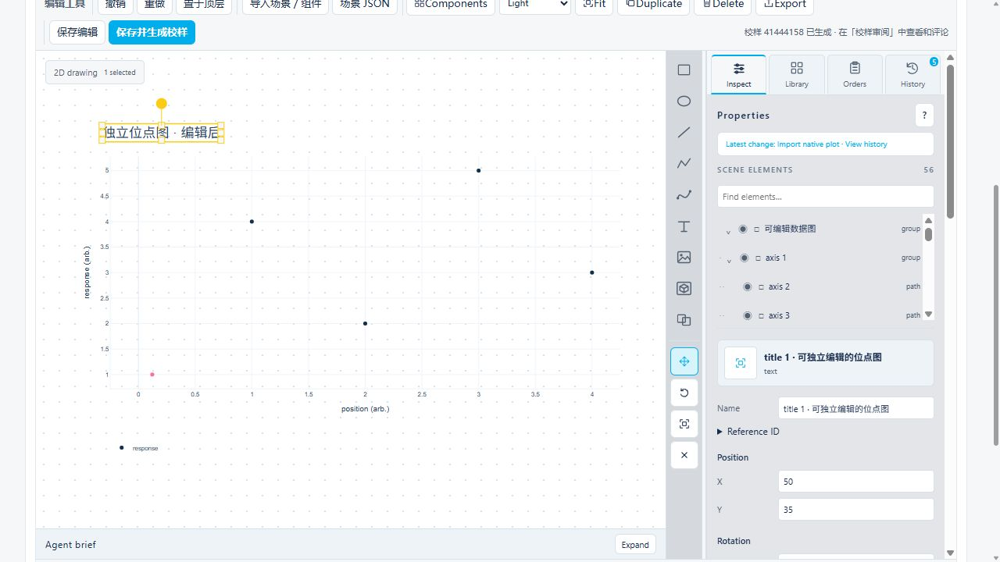

# Editable plot seeds

Open **编辑与校样 → 图形编辑** and click the plotted element, or select it
in the searchable scene tree. Each scatter marker, curve, axis/tick label,
title, legend and supported heatmap cell is a native element. Change its
position, size, color, opacity or typography in the inspector. Shift selects
multiple elements; undo/redo restores the complete scene. **保存编辑** saves
the figure, and **保存并生成校样** publishes the edited scene as a new proof.
Presentation edits do not rewrite the original numerical dataset.

New proof drafts retain the structured Plotly figure together with the exact
`inputs` and `recipe` used to produce it. The browser editor converts supported
plot parts into native scene elements; the seed request carries a UUID token and
source hashes so an asynchronous conversion can be accepted only for the draft
that requested it.

When a run has both a loadable raw dataset and a registered PNG/JPEG, the raw
dataset is preferred. Registered images remain available as a provenance-safe
legacy panel when no loadable source can be reconstructed. A legacy raster draft
shows an explicit upgrade action only when its frozen recipe is present. The
upgrade request includes the draft hash, source input/recipe hashes, and the
image element ID to replace; annotations, document text, assets, and unrelated
elements must be preserved by the editor host.

If the draft retained the original Plotly seed, the browser reuses it after
input hash verification. Otherwise the catalog reloads every frozen input and
re-renders the frozen recipe. This is a reproducible recipe reconstruction, but
it cannot promise byte-identical labels or browser defaults when the original
figure JSON was not retained; the draft records that warning.

An upgrade cannot be exact when the recipe is absent, an input artifact hash no
longer matches, or the source cannot be loaded. The UI should report that
diagnostic and keep the existing raster draft. Published revisions and their
comments remain immutable; upgrading creates a later draft/revision.

Recipes and input manifests are structured JSON and remain the scientific
source record. The native scene has a 10,000-element limit, so dense traces or
heatmaps may require a bounded conversion diagnostic rather than silently
discarding plot content.

Smoothed heatmaps, non-SVG traces and unsupported SVG constructs produce an
explicit diagnostic. Plain PNG/JPEG files have no recoverable point or text
structure; upgrade requires the original structured figure or verified input
artifacts and a frozen recipe. Formula text rendered as external SVG symbols
is not currently imported as editable mathematical glyphs.

Validation for 0.8.0 covers scatter, lines, comparisons, complex components,
heatmaps, panels, log axes and rich labels. All eight browser fixtures contain
zero plot image elements and export SVG without embedded images. Fixed-size
render comparisons have mean normalized channel error below 0.000334 and ink
overlap above 0.9802. These measurements cover the declared fixtures, not
arbitrary Plotly features. Oversized and smoothed fixtures preserve the entire
original scene/assets on rejection. Legacy upgrade preserves placement,
annotations and assets, with undo/redo restoring identical scenes.

The actual ResearchData app was also tested by changing one scatter point,
editing a title/font size and immediately publishing, and changing one heatmap
cell and publishing. Saved native scenes, frozen input hashes and exported
figures survive reopening. Previously published proofs and their comments
remain associated with their original revision.
